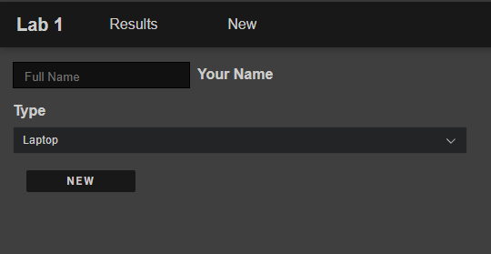
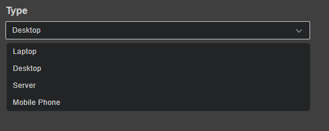

# Lab Issues
## Introduction

Please attempt to complete all issues as thoroughly as possible. There will be a discussion around your findings and solutions, so it is best to keep notes. Once you have completed all of the below, please refer to `README.md` to submit your findings.

## Issues

1. **Fix New Button Misalignment**  
    The "New" button on the `/new` page is indented to the right instead of being aligned with the form input and dropdown.  

    

    **Task:** Correct the alignment so the button is flush with the form elements.

2. **Fix Name Input Not Appearing When Typed**  
    Users have reported that text entered into the "name" input field does not appear as they type.  

    **Task:** Investigate and resolve the issue so that user input is visible in the "name" field in real time.

3. **Fix Searchable Dropdown Selected Item Not Highlighting**  
    When an item is selected in the searchable dropdown, it does not get highlighted in the list. The highlight should appear on the selected item whenever the dropdown is opened.  

    

    **Task:** Update the component so that the selected item is always highlighted when the dropdown is open.

4. **Add Success Message When a New Record Is Added**  
    Currently, when a new record is added, there is no feedback and the form does not reset.  
    **Task:**  
    - Show a confirmation message when a record is successfully added (i.e., response code 200).  
    - Ensure "name" and "type" fields are present on every request using both client-side and server-side validation.  
    - If required fields are missing, display an error message.

5. **Fix XSS Vulnerability When Adding New Records**  
    A recent security test identified an XSS vulnerability in the "name" field of the new record form. The tester demonstrated the issue by submitting the following input as proof of concept: ``.  
    **Task:** Implement a fix to prevent XSS attacks when adding new records.

6. **Add a Search Filter to the Results Page**  
    The results table does not currently support filtering by name.  
    **Task:**  
    - Add server-side filtering of results by name using GET URL parameters (e.g., `http://127.0.0.1:5015/results?search=test`).  
    - The table should display only items whose name contains or matches the search term.

7. **Add Email Address Field**  
    Users should provide an email address when submitting the form, however this should be partially redacted on the results page.  
    **Task:** Display email addresses on the results page, but mask them for privacy (e.g., `si**********@lab.local`).

8. **Download as CSV**  
    There is currently no option to download results.  
    **Task:** Add an option to download all results as a CSV file.

